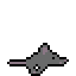

# mouse-jiggler

Simple mouse jiggler to keep your computer from sleeping. It moves the mouse cursor back and forth a set amount of pixels, after a set amount of time.


## Dependencies

- **evemu-tools**


## Instructions

To run mouse jiggles, first make sure the file has the permission to be executed as a program and **run it as root**.

It can take up to two arguments, the first argument is the amount of time between jiggles (in seconds) and the second argument is the distance of the jiggle (in pixels). If you don't provide arguments, the default values will be used: 30 seconds and 10 pixels.

You might want to be able to run mouse-jiggler from the terminal, from anywhere in your system. To achieve that follow these steps:

1. Create a folder named _scripts_ (or anything you want) inside your home folder.
2. Add this line to the _basrc_ file located in your home folder:

```
export PATH=$PATH:~/scripts
```

3. Mode the mouse-jiggler.sh file to the _scripts_ folder.
4. Now, you can run mouse-jiggler from any path in your system.

5. (optional) Rename the mouse-jiggler.sh file to something simpler (ex. _mj_) to be able to run mouse-jiggler writing a simpler command each time.


## Acknowledgement

Based on an [answer](https://askubuntu.com/a/1441179/1458474) by [Howard Connellan](https://askubuntu.com/users/1650401/howard-connellan) with some modifications by me.


## License

<a href="https://www.gnu.org/licenses/gpl-3.0.html"></a>

Copyright (c) 2023 Michael Kolesidis<br>
Licensed under the [GNU General Public License v3.0](https://www.gnu.org/licenses/gpl-3.0.html).
